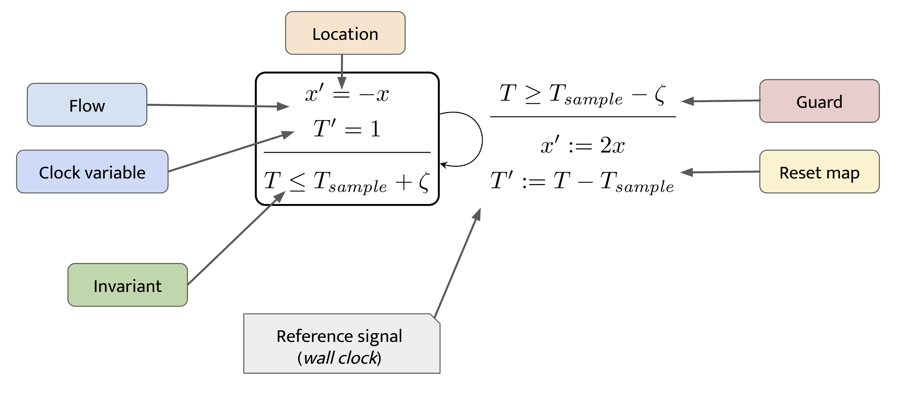
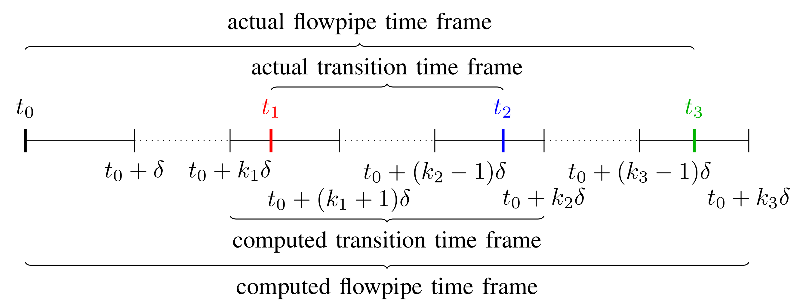

```@meta
DocTestSetup = :(using ReachabilityAnalysis)
CurrentModule = ReachabilityAnalysis
```

# Clocked hybrid systems

## Time-triggered LHA

So far we have focused on transitions that involve "spatial" variables.
If the system under consideration has transitions governed by time variables,
i.e. by variables whose dynamics are of the form ``t' = 1``, then decoupling the
spatial variables with the clock variables gives a computational advantage.
We refer to [[HG19]].





