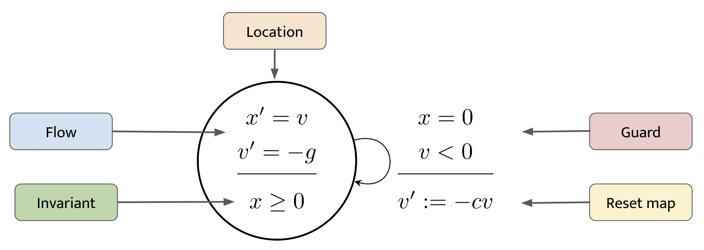

```@meta
DocTestSetup = :(using ReachabilityAnalysis)
CurrentModule = ReachabilityAnalysis
```

# Hybrid systems

## Introduction

Our running example is the *bouncing ball* model; although it is a very hybrid automaton,
it can be used to introduce the main notions involved in hybrid systems reachability.



```@example bouncing_ball
using ReachabilityAnalysis, Plots, Symbolics

function bouncing_ball()

    # symbolic variables
    var = @variables x v

    # falling mode with invariant x >= 0
    A = [0 1.; 0 0]
    b = [0, -9.8]
    flow = @system(z' = A*z + b, z ∈ HalfSpace(x ≥ 0, var))

    # guard x ≤ 0 && v ≤ 0
    FLOOR = HPolyhedron([x ≤ 0, v ≤ 0], var)

    # reset map v⁺ := -cv
    assignment = ConstrainedLinearMap([1 0; 0 -0.75], FLOOR)

    # hybrid system
    H = HybridSystem(flow, assignment)

    return H
end

H = bouncing_ball()

Z0 = Hyperrectangle(low=[10.0, 0], high=[10.2, 0])
prob = @ivp(H, z(0) ∈ Z0);

boxdirs = BoxDirections{Float64, Vector{Float64}}(2)
Thull = TemplateHullIntersection(boxdirs)

sol = solve(prob, T=30.0,
            alg=GLGM06(δ=0.01), # or LGG09 with template=boxdirs,
            clustering_method=LazyClustering(1, convex=false),
            intersection_source_invariant_method=Thull,
            intersection_method=Thull);

fig = plot(sol, vars=(0, 1), xlab="t", ylab="x(t)", lc=:blue)

import DisplayAs  # hide
fig = DisplayAs.Text(DisplayAs.PNG(fig))  # hide
```

```@example bouncing_ball
tspan(sol)
```

```@example bouncing_ball
fig = plot(sol, vars=(1, 2), xlab="x(t)", ylab="y(t)", lc=:blue)

import DisplayAs  # hide
fig = DisplayAs.Text(DisplayAs.PNG(fig))  # hide
```

## Formalism

TODO: definition of HA

## Hybrid solver algorithm

TODO: high-level description of the hybrid solve

## Flowpipe-guard intersections

In this section we illustrate the available methods to compute flowpipe-guard intersections. We will see how to use the function `cluster` to select a clustering strategies to cope with the case when there are several intersecting sets. We will also show examples of choosing different intersection templates.

## Customizing the solver

TODO: further examples on how to customize the discrete post-operator
