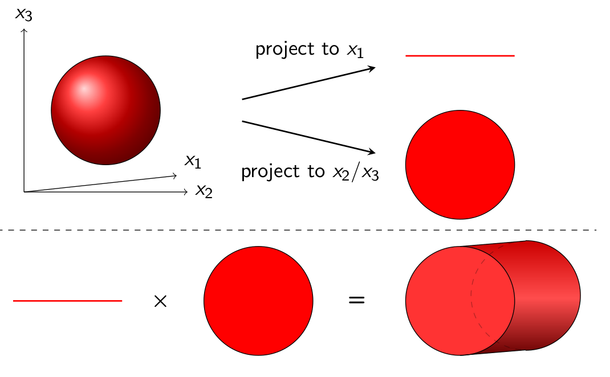

```@meta
DocTestSetup = :(using ReachabilityAnalysis)
CurrentModule = ReachabilityAnalysis
```

# Exploiting structure

In this section we explore different techniques that in one way or another
exploit the *structure* of the initial-value problem, or the type of verification
that we want to perform on the outputs.

## On-the-fly property checking

- In this section we consider reachability analysis for subsets of variables
of a given linear system.

- Method to lazily compute the flowpipe when we are only interested in outputs.
- Example with linear combination of state variables with LGG09 (eg. some of SLICOT benchmarks properties).

## State-space decomposition

- A section about BFFPSV18.



## Sparse systems

- Show option when Phi is sparse.

## Krylov subspace iterations

- Show case using Krylov when the state matrix is sparse.
